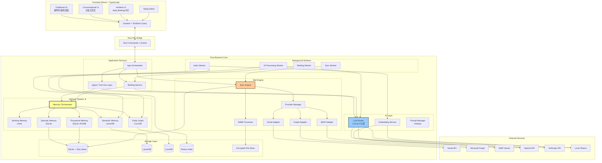
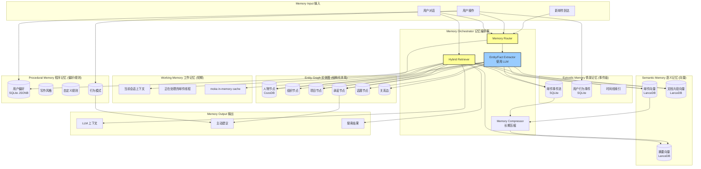
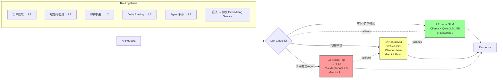
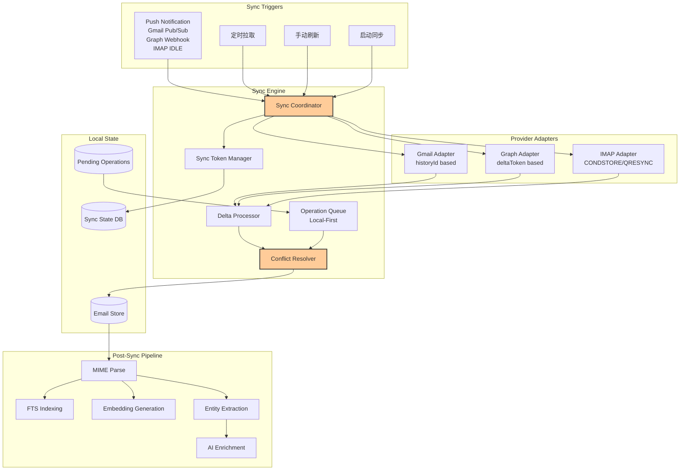

# Conversation
- conversationId: 2542cd0e-8ca2-4e85-b9b8-bad362b0c3c9
- provider: anthropic
- title: Email Future In AI Era
- exportAt: 09:05:47 GMT+0800 (Hong Kong Standard Time)

## Options
- provider: anthropic
- model: claude-opus-4-7
- options: [object Object]

## History
**You**
在ai时代 email这种交互方式 还会持续多久


**claude-opus-4-7**
这是个很有意思的问题。我的判断是：**email不会消失，但会被深度改造，可能持续相当长时间（10-20年甚至更久）**。

## 为什么email特别"耐打"

1. **协议中立性** — SMTP/IMAP是开放协议，不属于任何公司。这种去中心化让它像TCP/IP一样难以被替代。
2. **异步+正式性的不可替代** — 微信、Slack适合即时沟通，但跨组织、跨国、需要留痕的正式沟通，email几乎是默认选项。
3. **法律和身份属性** — 邮箱地址是互联网上的"身份证"，注册账号、合同、发票、政府通知都依赖它。
4. **巨大的存量惯性** — 全球40亿+用户，企业系统深度绑定。

## AI会怎么改变它

更可能的不是"取代"，而是**重新定义交互层**：

- **AI做收发的中间层**：你不再"读邮件"，而是让agent处理。Superhuman、Shortwave已经在做这件事。
- **邮件变成agent间通信协议**：人类不直接读，AI agents互相协商日程、报价、审批。
- **意图驱动而非格式驱动**：你说"跟那个客户跟进一下"，AI生成完整邮件。
- **垃圾邮件/钓鱼会更猛**（AI生成），反过来推动加密和身份验证升级。

## 什么场景会真的萎缩

- **公司内部沟通**：Slack/飞书/Teams已经吃掉很多。
- **个人日常通讯**：早就被即时通讯取代了。
- **营销邮件**：可能被AI助手直接过滤掉，打开率持续下降。

## 我的预测

未来email可能像今天的**SMS或电话号码**——不再是日常体验的中心，但作为基础设施一直存在。你可能很少"打开邮箱"，但你的AI agent每天都在替你处理几百封。

真正的问题不是"email会不会消失"，而是**"人类直接读email的时代会不会结束"**——这个我觉得5-10年内就会发生明显转变。


**You**
那邮件客户端应该如何演化


**claude-opus-4-7**
这是个很值得深挖的问题。邮件客户端的演化方向，本质上是在回答："**当人不再是邮件的主要消费者时，客户端为谁而设计？**"

## 演化的三个阶段

### 阶段一：AI辅助层（现在 - 2-3年）
**核心特征：人还是主体，AI是副驾驶**

- 智能摘要、分类、优先级排序（Superhuman、Shortwave已在做）
- 一键生成回复草稿
- 自然语言搜索："上个月那个跟我谈合作的日本公司叫什么"
- 自动提取行动项到todo/日历

这个阶段客户端形态变化不大，主要是侧边栏多了个AI助手。

### 阶段二：意图驱动层（3-7年）
**核心特征：人表达意图，AI执行交互**

收件箱不再按时间排序，而是按"**需要你做什么**"组织：

```
今天需要你决策的事 (3)
  └ 张总的合作提议 — AI已分析利弊
今天AI已替你处理 (47)
  └ 展开查看
等待对方回复 (12)
```

UI重心从"邮件列表"转向"**任务和决策流**"。邮件本身被隐藏在底层，像今天我们不会去看HTTP请求一样。

### 阶段三：Agent协议层（7-15年）
**核心特征：人可能完全不打开客户端**

- 客户端变成**agent控制台**：你管理的是AI的行为策略，而不是邮件
- 界面可能是对话式的："今天我替你拒绝了3个会议邀请，批准了团队的报销，跟供应商谈到了8.5折"
- 邮件协议本身可能扩展出**结构化字段**（类似MCP），让AI间通信更高效

## 几个关键的设计转变

| 传统客户端 | 新客户端 |
|-----------|---------|
| 收件箱 = 时间流 | 收件箱 = 决策队列 |
| 操作单位是"邮件" | 操作单位是"事项/关系/项目" |
| 用户读和写 | 用户审阅和授权 |
| 通知 = 来信提醒 | 通知 = AI请求人类介入 |
| 文件夹/标签 | 语义化上下文图谱 |

## 真正的难点（也是机会）

1. **信任边界** — 哪些邮件AI可以自动回？哪些必须人确认？这个权限模型可能是新客户端最重要的设计。
2. **上下文管理** — AI需要知道你和每个联系人的历史、你的偏好、当前项目状态。这要求客户端从"邮件存储"变成"**关系和上下文的知识库**"。
3. **可解释性** — 当AI替你回了一封邮件，你必须能快速理解它为什么这么回，以及如何修正。
4. **跨账号统一** — 个人邮箱、工作邮箱、各种通知，AI需要跨域理解，但隐私边界要清晰。
5. **对抗AI生成内容** — 当垃圾邮件、钓鱼都是AI写的，客户端需要内置"AI身份验证"和"内容真实性"机制。

## 谁会赢

我个人的判断：

- **传统玩家（Gmail、Outlook）**会用AI升级现有体验，吃掉80%大众市场。
- **新势力（Superhuman、Shortwave、HEY）**会先在高端市场验证新范式。
- **真正的颠覆者可能根本不叫"邮件客户端"** — 它可能是个通用AI助手（比如未来的ChatGPT、Claude desktop），邮件只是它处理的一个数据源。

最有意思的可能性：**邮件客户端会"消失"——不是产品消失，而是它溶解进一个更大的"个人AI操作系统"里，和日历、文档、聊天、任务统一在一个agent界面下**。

你是在思考做这方面的产品，还是单纯好奇？我可以针对性地再展开。


**You**
在思考做这方面的产品


**claude-opus-4-7**
太好了，那我们认真聊。做AI邮件产品现在是个**红海里的蓝海**——表面上玩家很多（Superhuman、Shortwave、Notion Mail、Gemini in Gmail…），但真正的范式转变还没发生，机会窗口还开着。

我从几个产品决策的关键维度展开，你可以对照着想。

## 一、先想清楚：你在赌哪个未来

不同的时间点对应完全不同的产品形态，**赌错时间点比赌错方向更致命**：

- **赌2-3年**：做"更聪明的Superhuman"。AI是feature，核心还是邮件体验。容易做，但天花板低，且巨头随时可以碾压。
- **赌5-7年**：做"邮件操作系统"。重新定义收件箱为决策队列，押注用户愿意改变工作流。难，但护城河深。
- **赌10年+**：做"通用AI助手，邮件是入口"。邮件只是触手，本质是个人agent平台。极难，但天花板最高。

**我的建议：从赌2-3年开始，但架构上为5-7年留好接口。**别一上来就做太前卫的东西，用户教育成本会杀死你。

## 二、最关键的战略选择

### 1. To C 还是 To B？
- **To C**：天花板高（Superhuman证明了愿意付30刀/月的人存在），但获客难、留存难。
- **To B**：客单价高、付费意愿强，但销售周期长，且企业邮件被Microsoft/Google锁死。
- **To Prosumer**（创始人、销售、投资人、律师等高价值个体）：**我认为这是当前最好的切入点**。这群人邮件密度高、时间值钱、愿意付费、决策快。

### 2. 客户端 还是 中间层？
- **做客户端**：要解决IMAP/SMTP同步、附件、搜索、跨平台…工程量巨大。
- **做Gmail/Outlook插件**：轻，但被平台限制（Google可能下个版本就内置同样功能）。
- **做MCP式中间层**：你的AI接管邮件处理，用户继续用原客户端。**这个思路被低估了**。

### 3. 通用 还是 垂直？
通用AI邮件助手已经是巨头战场。垂直可能更有机会：
- **销售场景**（已有Lavender、Lemlist）
- **客服/支持**（Front很强）
- **投资人/BD**（CRM+邮件融合，未饱和）
- **律师/咨询**（合规要求高，巨头难做）
- **招聘**（邮件密度极高）

## 三、真正的差异化机会（我看到的几个空白点）

### 1. **"关系记忆"而非"邮件管理"**
所有现有产品都在管理"邮件"这个对象，但用户真正在管理的是"**关系**"。
- 一个人在你过往邮件里出现过20次，你和他什么关系？聊过什么？欠他什么？答应过什么？
- 现有AI邮件工具几乎都没做好这件事——它们对单封邮件理解很好，对**人和关系的长期记忆**很差。

### 2. **"出站智能"远未被解决**
现有工具都在优化"读邮件"，但**写邮件**的痛点更大：
- 我要给一个3个月没联系的客户写跟进，AI能不能自动调取所有上下文、判断合适的语气、生成多个版本？
- 这块Lavender做了一点，但只在销售场景。

### 3. **决策日志和承诺追踪**
邮件里有大量"我下周给你发方案"、"等季度结束再聊"这种承诺。没有产品系统化追踪这些。

### 4. **跨邮箱的统一AI**
我有3个邮箱（个人、工作、副业），但没有产品能把它们当成"我的人际网络"统一理解。

### 5. **Agent间通信的早期协议**
如果未来是AI agent互发邮件，谁定义这个协议？早期切入有标准制定的机会（虽然很可能被巨头拿走）。

## 四、容易踩的坑

1. **过度依赖LLM API成本** — 邮件量大，每封都过GPT-4成本爆炸。需要分层：本地小模型做预处理，大模型只处理关键决策。
2. **隐私是地雷** — 用户最敏感的数据都在邮件里。架构上要么端侧处理，要么有极强的安全叙事。
3. **冷启动数据** — AI邮件的价值依赖对用户历史的理解，但新用户没有这个上下文。需要设计"快速冷启动"流程。
4. **被Gmail/Outlook平台风险绑架** — API随时可能被限制（Google已经收紧过几次）。
5. **"AI替我回邮件"的信任门槛极高** — 一封发错的邮件可能毁掉一个客户。MVP不要碰自动发送。

## 五、如果是我，会怎么开始

**MVP聚焦一个非常窄的痛点，做到10倍好：**

举几个可能的切入点：
- "**给创始人的关系CRM**"——自动从邮件里提取所有人脉、对话历史、未完成承诺，每周给你一份"该联系的人"清单。
- "**邮件决策助手**"——只解决一个问题：每天告诉你哪3封邮件必须今天回，并预生成回复。
- "**承诺追踪器**"——专门提取和追踪邮件里的所有承诺（你给别人的+别人给你的）。

每个都是单点突破，不和Superhuman正面竞争，但都能成为更大产品的种子。

---

我想反过来问你几个问题，帮你聚焦：

1. **你自己的邮件场景是什么？** 你最痛的点是什么？（自己是用户是最好的起点）
2. **你的技术储备和团队规模？** 决定能做多重的事。
3. **你有什么特殊的资源或洞察？** 比如某个行业的深度理解、特殊的数据来源、AI技术能力？
4. **你打算做1-2年的小生意，还是赌一个大平台？**

回答这几个问题，我可以帮你想得更具体。


**You**
面向政府，加密邮件是其中一个主要考量


**claude-opus-4-7**
政府场景 + 加密邮件，这是一个**完全不同的赛道**——和我前面说的消费级/Prosumer路线几乎没有重叠。我重新组织一下思路。

## 先说大判断

这是个**慢生意、深护城河、高门槛**的市场。做对了能成为基础设施级公司（参考国外的Proton、Virtru，国内的网易企业邮、263、Coremail），但**和"AI原生"产品的玩法逻辑很不一样**——AI在这里是辅助卖点，**合规、加密、可控、自主可控**才是命门。

## 一、先搞清楚"政府"到底是什么客户

政府不是一个市场，是好几个市场，**不同部门的需求差异极大**：

| 类型 | 核心诉求 | 采购特点 |
|------|---------|---------|
| 党政机关（部委、省市） | 国密合规、内外网隔离、信创适配 | 集采、关系驱动 |
| 涉密单位（军工、保密局相关） | 等保三级/四级、分级保护 | 资质门槛极高 |
| 公检法 | 电子证据、留痕、不可篡改 | 行业方案 |
| 国企央企 | 信创替代、合规审计 | 跟随政策 |
| 事业单位（高校、医院等） | 性价比、易用性 | 接近企业市场 |

**先选一个切入点**。对小团队来说，部委级和涉密单位门槛太高（需要保密资质、涉密集成资质等），通常**从地方政府或国企央企切入更现实**。

## 二、政府加密邮件的真实痛点

我列一下这个领域里**真实存在但没被解决好**的问题：

### 1. **国密合规的工程化痛**
- SM2/SM3/SM4算法在邮件全链路（传输、存储、签名、附件）的落地，很多产品做得很糙。
- 跨系统互操作性差——A单位的加密邮件B单位收不到/解不开是常态。

### 2. **"加密"和"易用"的死亡矛盾**
- 现有政务加密邮件普遍体验极差（界面像2005年的产品），用户偷懒走微信/QQ传文件，反而造成更大泄密风险。
- **谁能做出"像Gmail一样好用的国密邮件"，谁就有机会。**

### 3. **大附件和涉密文件流转**
- 政务场景大量需要传送红头文件、扫描件、设计图纸，传统邮件附件大小限制是硬痛点。
- 涉密文件需要"阅后即焚"、"禁止转发"、"禁止下载"、"水印追溯"等DRM能力。

### 4. **跨网传输（涉密网/政务外网/互联网）**
- 物理隔离环境下的邮件如何安全跨网，是真需求。通常通过单向光闸/摆渡，但体验和效率都差。

### 5. **审计、留痕、追溯**
- 谁发的、谁看的、何时看的、是否截屏、是否转发——全链路可追溯。

### 6. **AI能力的合规化**
这是你的差异化机会：
- **大模型不能用境外的**（OpenAI、Anthropic都不行）
- **数据不能出本地/私有云**
- **必须支持国产模型本地化部署**（千问、智谱、DeepSeek、文心等）
- 这反而是机会——大厂的云端AI邮件方案进不来，本地化AI邮件是空白。

## 三、AI在政府加密邮件里的合理角色

不是替代人决策，而是做"**合规增强**"：

1. **敏感信息识别**——AI自动检测邮件里是否含有敏感词、涉密内容、个人信息，发送前预警/拦截。
2. **密级自动建议**——根据内容自动建议"内部、秘密、机密"等密级标签。
3. **公文写作辅助**——政府公文格式严格（标题、主送、正文、落款都有规范），AI辅助起草能极大提效。
4. **会议纪要、批文摘要**——长邮件链自动总结。
5. **智能分发**——根据内容自动建议抄送对象（基于历史规则）。
6. **翻译**（涉外部门刚需，但必须本地化模型）。

**不要做**：自动回复、自动决策、智能agent——政府场景不接受AI替人做决定，权责必须清晰。

## 四、关键的产品/商业决策

### 1. **自研 vs 集成**
- 加密邮件协议层（PGP/S/MIME/国密扩展）很重，建议**底层用开源（如基于Postfix/Dovecot魔改）+ 自研AI层和体验层**。
- 完全从零做MTA是浪费时间。

### 2. **私有化部署是默认选项**
- SaaS模式在政府基本走不通，**必须支持本地化部署、信创适配（鲲鹏、海光、麒麟、统信）**。
- 这意味着你的产品架构从第一天就要为私有化设计。

### 3. **资质先行**
不同级别项目要求不同资质，按需准备：
- 等保三级测评
- 商用密码产品认证（密码局）
- 涉密信息系统集成资质（如果做涉密）
- 软件著作权、CMMI

**这些资质本身就是护城河**，新进入者要花1-2年才能补齐。

### 4. **渠道和关系**
- 政府市场是**关系+合规+产品**三位一体，纯产品打法走不通。
- 通常需要找本地集成商作为合作伙伴，或者自己搭建省级代理体系。

### 5. **定价模式**
- 通常按用户数License + 实施费 + 年度运维费
- 一个地市级项目通常50-300万，省级项目500万-数千万

## 五、我看到的几条可行路径

### 路径A：**国密合规AI邮件网关**（轻切入）
不替换现有邮件系统，做一个**插件/网关**，给现有政府邮件系统加上：
- 国密加密
- AI敏感信息检测
- 公文辅助写作
- 审计追溯

优点：实施周期短，不用替换原有系统，容易切入。
缺点：客单价低，被现有厂商挤压。

### 路径B：**信创全栈替代邮件系统**（重切入）
做完整的国密邮件系统，吃信创替代的红利。
优点：客单价高、护城河深。
缺点：竞争对手强（Coremail、网易、263等都在做信创版），需要差异化。**AI是你的差异化武器**。

### 路径C：**垂直场景化方案**（窄切入）
专做某个细分场景：
- **公检法的电子卷宗邮件流转**
- **军工保密单位的跨网邮件**
- **国企的合规审计邮件**

每个都是几十亿的市场，做透一个就能起来。

## 六、需要警惕的现实

1. **回款周期长** — 政府项目从立项到回款通常1-2年，现金流压力大。
2. **定制化魔咒** — 每个客户都要改，规模化困难。需要从架构上抽象。
3. **政策依赖性强** — 信创、等保、密评的节奏直接决定你的市场节奏。
4. **巨头入场** — 华为、阿里、腾讯、奇安信都在政府市场，要想清楚差异化。
5. **AI幻觉在政务场景是灾难** — 公文一字之差出大事，AI输出必须强约束。

---

我想问你几个具体问题，才能帮你想得更深：

1. **你的资源背景** — 有政府客户资源吗？团队是技术驱动还是关系驱动？这决定了走哪条路径。

2. **目标客户层级** — 部委、省级、地市、区县？还是国企央企？不同层级打法完全不同。

3. **"加密"具体指什么** — 国密合规？端到端加密？涉密分级保护？这是三个不同的技术栈。

4. **你看重AI的哪个角色** — 是真把AI做成核心卖点，还是作为合规邮件系统的一个增强模块？

5. **是创业还是公司内部立项** — 决定了能投入多少时间和资金。

你回答这些之后，我可以帮你把产品形态、技术架构、GTM策略想得更具体。


**You**
我只做邮件客户端


**claude-opus-4-7**
明白了，**只做客户端**这个边界很清晰，能极大降低复杂度。但政府场景下"只做客户端"也有它独特的玩法，我重新梳理。

## 这个定位的本质

你做的是**"政府用户的加密邮件入口"**——服务器端的邮件系统（无论是Coremail、网易、Exchange还是自建）继续用，你做更好用、更安全、AI增强的客户端。

类比：**Foxmail/Outlook之于Exchange，Superhuman之于Gmail**。

## 一、这个定位的优势和劣势

### 优势
- **工程量可控**——不用碰MTA、存储、反垃圾、备份等重活
- **不和邮件系统厂商正面竞争**——可能反而能合作
- **迭代快**——客户端的体验差异化空间大
- **资质门槛相对低**——客户端比服务端少一些认证要求

### 劣势
- **依赖服务端协议**——IMAP/SMTP/Exchange/国密扩展，遇到非标协议会很痛
- **客单价天花板低**——客户端通常按License卖，单价比服务端低一个数量级
- **价值容易被低估**——采购方习惯把客户端当"赠品"

## 二、政府客户端市场的真实格局

先认清现状：

| 现有方案 | 状况 |
|---------|------|
| **Foxmail** | 用户量大，但已停滞，无国密、无AI |
| **Outlook** | 信创替代名单上要被换掉 |
| **网易/Coremail自带客户端** | 通常体验一般，绑定自家服务 |
| **国产信创邮件客户端**（如TOM、亿邮、彩讯等） | 体验普遍差，AI能力弱 |
| **Thunderbird** | 开源但没人维护中文政务场景 |

**核心机会：信创替代浪潮下，政府正在大规模替换Outlook/Foxmail，市面上没有一个"好用且AI增强且国密合规"的客户端。** 这是真实的市场空白。

## 三、产品的关键设计决策

### 1. **跨平台策略**
政府环境必须支持：
- **Windows**（仍是主力）
- **国产Linux**（麒麟、统信UOS）—— 信创刚需
- **国产CPU**（鲲鹏、飞腾、龙芯、海光）适配
- **macOS**（少数领导用）
- **移动端**（iOS/Android/鸿蒙）—— 后期再做

技术选型建议：**Electron / Tauri**。Tauri更轻，但Electron生态成熟、调试方便、信创适配资料多。**初期我建议Electron，性能问题后期再优化。**

### 2. **协议兼容性**
必须支持：
- **IMAP/SMTP/POP3**（基础）
- **Exchange/EWS**（很多政府还在用）
- **国密SSL/TLS**（SM2/SM3/SM4传输加密）
- **S/MIME + 国密扩展**（端到端签名加密）
- **主流国产邮件服务商的私有协议**（Coremail、网易企业邮等）

**协议兼容是脏活累活，但也是护城河**——做得好的客户端，新进入者很难快速追上。

### 3. **加密的具体形态**
"加密邮件"可以指三个层次，要想清楚做哪个：

| 层次 | 含义 | 实现难度 |
|------|------|---------|
| **传输加密** | 客户端到服务器用SM2/SM4 | 低，配置即可 |
| **存储加密** | 本地邮件库加密 | 中，自己做 |
| **端到端加密** | 发件人到收件人全程密文，服务器看不到 | 高，需要密钥管理体系 |

**端到端加密是最大的差异化点，但也是最难的**——它需要：
- 证书/密钥管理（对接政府CA体系）
- 密钥分发（如何让A给B加密时拿到B的公钥）
- 多设备同步（密钥如何安全跨设备）
- 离职/失密后的密钥撤销

我的建议：**先做好传输加密+存储加密+S/MIME国密签名**，端到端加密作为高端版本逐步推进。

### 4. **AI能力的本地化**

政府场景**AI必须本地化**，这是硬要求。设计上要：

- **支持对接私有化部署的国产大模型**（千问、DeepSeek、智谱等的私有化版本）
- **客户端不直连外网AI**——所有AI请求走客户单位的私有化模型
- **提供轻量本地模型选项**——对没有私有化大模型的小单位，客户端内置小模型做基础能力（敏感词检测、摘要等）
- **AI能力可关闭**——某些涉密场景必须能完全关闭AI

这是**关键的产品架构决策**：你的客户端要做成"AI能力可插拔"的，能对接不同的后端模型。

### 5. **AI功能的优先级**

我建议这样排：

**第一梯队（必做、安全）：**
- 邮件摘要（长邮件、长邮件链一键总结）
- 智能搜索（自然语言搜索历史邮件）
- 公文写作辅助（基于公文模板生成）
- 敏感信息检测（发送前提醒）
- 翻译（涉外部门刚需）

**第二梯队（增值）：**
- 智能分类、优先级标注
- 待办/承诺提取
- 会议邀请智能解析
- 附件内容理解（PDF、Word自动摘要）

**第三梯队（暂不做）：**
- 自动回复
- AI Agent自动操作
- 跨人际关系图谱

**第三梯队的能力在政府场景是负资产**——任何"AI替我做决定"的功能在政务场景都会被拒绝。

### 6. **必须有的"政务特性"**

这些是普通邮件客户端没有，但政务场景必备的：

- **公文格式支持**（红头文件、签批、套红）
- **密级标识**（公开/内部/秘密/机密标签）
- **水印**（屏幕水印、附件水印）
- **防截屏/防复制**（高安全模式）
- **阅后即焚 / 限时阅读**
- **强制留痕审计**（所有操作上报审计服务器）
- **统一身份认证**（对接OA、LDAP、CA）
- **离线可用**（很多内网环境）

## 四、技术架构的几个关键点

```
┌─────────────────────────────────┐
│   UI层 (Electron + React/Vue)    │
├─────────────────────────────────┤
│   AI能力抽象层（可插拔）         │
│   ├ 本地小模型                   │
│   └ 私有化大模型适配器           │
├─────────────────────────────────┤
│   业务逻辑层                     │
│   ├ 邮件管理 ├ 公文 ├ 审计       │
├─────────────────────────────────┤
│   协议适配层                     │
│   ├ IMAP ├ SMTP ├ EWS ├ 国密     │
├─────────────────────────────────┤
│   加密/密钥管理层                │
│   ├ 国密算法 ├ CA对接 ├ 密钥库   │
├─────────────────────────────────┤
│   本地存储 (加密SQLite)          │
└─────────────────────────────────┘
```

几个要点：
1. **AI层一定要抽象**——不同客户用不同模型，不能写死
2. **协议适配层要可扩展**——会不断遇到非标协议
3. **加密层要独立**——便于过密评、便于不同客户用不同密码模块

## 五、商业模式

客户端的几种卖法：
1. **按License卖**（最常见，每用户每年X元）
2. **打包卖**（和某邮件系统厂商OEM合作，绑定销售）
3. **免费基础版+增值AI模块**（AI单独收费）
4. **大客户定制**（针对部委级客户做深度定制）

**关键：客户端单卖天花板低，必须想办法和"AI模块"或"加密能力"绑定，把单价做上去。**

举例：
- 客户端基础版：50元/用户/年
- AI增强模块：200元/用户/年
- 端到端加密模块：300元/用户/年
- 整体卖到500-800元/用户/年的水平

一个3000人的厅局级单位，就是150-240万的合同。

## 六、GTM和切入策略

### 路径建议
1. **第一年：找2-3个标杆客户做深做透**——不赚钱也要做出案例。最好是地市级政府或省厅下属单位，决策链短。
2. **第二年：通过标杆撬动同省/同行业**——政府市场强**示范效应**。
3. **第三年：和邮件系统厂商OEM合作**——Coremail、网易、263都缺好客户端，可以谈打包销售。

### 渠道
- 直销+集成商混合
- 关键是找到**懂政府采购+有关系**的销售合伙人
- 早期参加政府IT展会、信创联盟活动

### 资质准备（按优先级）
1. **软件著作权**（必备，几个月）
2. **等保三级测评**（产品过测，半年）
3. **商用密码产品认证**（如果做国密，1年左右）
4. **信创兼容性认证**（鲲鹏、麒麟、统信，几个月）

## 七、警告：这些坑你大概率会踩

1. **协议兼容是无底洞**——每个客户的邮件系统都有奇葩配置，准备好长期投入
2. **国密落地很脏**——SM2/SM3/SM4在不同密码模块、不同OS、不同CPU上的兼容性问题很多
3. **政府客户的需求是"既要又要还要"**——必须有明确的产品边界，否则被定制需求拖死
4. **AI模型私有化部署的客户成本高**——很多小单位部署不起大模型，你需要给出"轻量方案"
5. **回款周期1-2年**——现金流准备要充足
6. **被Foxmail情怀绑架**——很多政府用户用了20年Foxmail，迁移阻力大，要做好导入工具

## 八、我会怎么开始

如果是我，第一年的产品MVP会是：

> **一个支持国密、跨平台（Windows + 麒麟/统信）、对接私有化大模型的政务邮件客户端，第一版聚焦三个杀手级AI功能：长邮件摘要、公文写作辅助、发送前敏感信息检测。**

不做端到端加密、不做高级DRM、不做移动端，把这三件事做到极致，找一个标杆客户跑通。

---

为了帮你想得更具体，我还需要知道：

1. **你的技术栈背景** — 客户端开发经验？国密/PKI了解吗？AI工程能力？
2. **是否有政府客户资源或销售合伙人** — 这个市场没渠道几乎做不进去
3. **启动资金和团队规模** — 决定能不能撑过1-2年回款周期
4. **你的目标客户层级** — 想清楚是地市级、省厅级还是部委级
5. **是否考虑和现有邮件系统厂商合作** — OEM路线 vs 独立品牌

你回答这些之后，我们可以把产品架构、第一版MVP、第一年的里程碑细化下来。


**You**
客户是香港政府，已经有销售合伙人，后端已经采用coremail


**claude-opus-4-7**
这个信息非常关键，**整个产品定位和打法都要重新调整**。香港政府 + Coremail后端，这是个非常具体的场景，我重新梳理。

## 一、关键信息带来的根本性变化

### 1. **不是大陆信创市场，是香港政府市场**
这意味着：
- ❌ **不需要国密SM2/SM3/SM4**——香港用国际标准（AES、RSA、ECC）
- ❌ **不需要鲲鹏/麒麟/统信适配**——香港政府主要还是Windows + macOS
- ❌ **不需要等保、密评、信创认证**——香港有自己的合规体系
- ✅ **需要符合香港的合规要求**：
  - **PDPO（个人资料隐私条例）**
  - **政府IT安全政策（ISPG / Baseline IT Security Policy S17）**
  - **可能需要Common Criteria认证**（高密级场景）
- ✅ **繁体中文 + 英文双语**是基本要求
- ✅ **可能需要支持粤语语境的AI**（公文、邮件用语和大陆有差异）

### 2. **后端是Coremail，不是自建**
这是个**巨大的优势和约束**：

**优势：**
- 协议层基本不用操心，Coremail支持标准IMAP/SMTP/EWS和自家协议
- Coremail在香港政府有一定部署基础，你不用解决"为什么换邮件系统"的问题
- 可以直接和Coremail的API/协议对接，不用从零做协议适配

**约束：**
- 你的客户端必须**和Coremail深度兼容**——这是甲方的硬要求
- Coremail自己也有客户端，你们事实上是**竞争+共生关系**
- Coremail的私有协议、扩展功能你都需要支持（比如它的反垃圾标记、会话视图、企业通讯录等）

**关键动作：尽早和Coremail建立技术对接关系**——拿到完整的API文档、协议扩展、SDK。最好能成为它的官方"推荐客户端"或OEM合作伙伴。

### 3. **已经有销售合伙人**
这意味着：
- GTM不是你的主要担忧，**产品和交付才是**
- 销售合伙人大概率已经和某些政府部门有沟通，**先去问清楚目标客户是哪个部门、痛点是什么**
- 不要凭空设计产品，**先和2-3个目标部门做深度访谈**

## 二、香港政府邮件场景的真实情况

香港政府的IT环境我帮你梳理几个关键事实：

1. **OGCIO（政府资讯科技总监办公室）**统一管IT策略，但各部门有相当自主权。
2. **Outlook + Exchange / O365** 仍是主流，但近年有"去微软化"趋势，部分部门转向其他方案——**这就是Coremail进入的窗口**。
3. **政府常用的协作邮件场景**：
   - 部门内部公文流转
   - 跨部门协调（要走加密）
   - 对外（市民、企业、其他地区政府）通信
   - 立法会、区议会相关沟通
4. **语言混用**：繁体中文 + 英文 + 偶尔简体，公文有固定的双语格式。
5. **加密邮件的现实需求**：
   - 主要是和**外部敏感对象**通信（律政司、廉政公署、警务处等的外部邮件）
   - 内部多数靠网络隔离而非端到端加密
   - 标准多为 **S/MIME** 或 **PGP**，香港政府CA签发证书

## 三、产品定位的重新校准

基于这些约束，产品定位应该是：

> **一个深度兼容Coremail后端、支持香港政府合规要求、集成AI能力的现代化加密邮件客户端，支持Windows/macOS双平台，繁中/英双语，对标Outlook但更智能、更安全。**

## 四、产品的关键设计决策（更新版）

### 1. 跨平台
- **Windows + macOS** 是必须
- **iOS + Android** 第二阶段（香港政府移动办公需求在增长）
- 不需要Linux国产系统

技术栈：**Electron** 仍是最优解（生态成熟、双平台一致、繁中支持好）。

### 2. 加密体系
香港场景的加密应该是：
- **传输加密**：标准TLS 1.3
- **端到端加密**：S/MIME（基于X.509证书）+ 可选PGP
- **证书来源**：香港邮政电子核证服务（Hongkong Post e-Cert）或政府内部CA
- **本地存储加密**：AES-256
- **密钥管理**：支持智能卡 / USB Token（香港政府习惯用硬件证书）

**重点：S/MIME的体验做好就是杀手级特性**——Outlook的S/MIME体验非常糟糕，证书管理、跨设备、密钥备份都是痛点。如果你的客户端能让S/MIME"像普通邮件一样好用"，就是真正的差异化。

### 3. 和Coremail的深度集成
这是**最关键的工程优先级**：
- 完整支持Coremail的IMAP扩展
- 支持Coremail的企业通讯录同步（LDAP）
- 支持Coremail的会话视图、标签体系
- 支持Coremail的大附件中转（中转站）
- 支持Coremail的反垃圾、反钓鱼标记
- 支持Coremail的撤回、已读回执等增强功能

**建议：把"Coremail最佳客户端"作为产品的核心定位之一**——既差异化于Outlook，又和Coremail形成共生。

### 4. AI能力
香港场景下的AI设计：

**模型选择：**
- 不能用大陆的模型（数据合规问题）
- 不能用境外OpenAI（同样合规问题）
- 推荐路径：
  - **本地化部署的开源模型**：Llama 3、Qwen（开源版本）、Mistral
  - **Azure OpenAI香港/亚洲区域**（如果合规允许）
  - **政府自建AI平台**（如果香港政府有，对接进去）

**关键功能（按优先级）：**

第一梯队：
- **繁中/英双语邮件摘要**（长邮件、长邮件链一键总结）
- **公文写作辅助**（香港政府公文格式：To/From/Subject/Reference等有固定格式）
- **中英互译**（高频刚需，香港政府日常）
- **智能搜索**（自然语言搜索历史邮件）
- **敏感信息检测**（发送前提醒，符合PDPO）

第二梯队：
- 待办/承诺提取
- 会议邀请智能解析（香港用Outlook邀请格式）
- 附件PDF/Word内容理解和摘要
- 智能分类、优先级

不做：
- AI自动回复 / 自动决策
- 关系图谱、CRM类功能（政府场景不需要）

### 5. 香港政府特性
必须有的：
- **繁体中文UI**（重要！很多大陆产品的繁中是机器转的，体验差）
- **英文UI完整对等**
- **公文模板**（香港政府公文有固定格式，例如memo、minute、submission）
- **密级标识**：Restricted / Confidential / Secret（不是大陆的"秘密/机密"）
- **数据本地化**：所有数据在香港境内，不出境
- **审计日志**：操作留痕，符合政府IT政策
- **强身份认证**：支持智能卡、生物识别、MFA

## 五、技术架构（针对你的场景）

```
┌─────────────────────────────────────┐
│  UI (Electron + React)              │
│  繁中/英双语，符合HK政府视觉规范    │
├─────────────────────────────────────┤
│  AI层（可插拔）                     │
│  ├ 本地模型适配器                   │
│  ├ Azure OpenAI HK适配器            │
│  └ 政府AI平台适配器                 │
├─────────────────────────────────────┤
│  业务层                             │
│  ├ 邮件 ├ 公文 ├ 审计 ├ 翻译        │
├─────────────────────────────────────┤
│  Coremail深度集成层                 │
│  ├ IMAP+扩展 ├ LDAP ├ 私有API       │
├─────────────────────────────────────┤
│  加密层                             │
│  ├ TLS ├ S/MIME ├ PGP ├ 智能卡      │
├─────────────────────────────────────┤
│  本地加密存储 (SQLCipher)           │
└─────────────────────────────────────┘
```

## 六、第一年的MVP建议

如果是我，第一版MVP聚焦：

> **一个深度兼容Coremail、支持S/MIME加密、繁中/英双语、集成3个核心AI功能（双语摘要、公文辅助、中英翻译）的Windows + macOS客户端。**

**不做的事：**
- 移动端（V2再做）
- PGP（S/MIME优先，PGP后补）
- 复杂的AI Agent能力
- 关系图谱、CRM功能
- 大陆信创适配

**6-9个月做出第一版，找一个香港政府部门做试点。**

## 七、几个关键的战略动作

1. **立刻做的事**：
   - 通过销售合伙人安排和**2-3个目标政府部门**的访谈，了解真实痛点
   - 联系**Coremail香港或亚太团队**，建立技术合作关系
   - 研究香港政府的**ISPG / Baseline IT Security Policy** 完整文档

2. **3个月内**：
   - 完成产品需求文档和技术方案
   - 搞定Coremail的API接入
   - 做出可演示的Demo（哪怕只有几个核心功能）

3. **6-12个月**：
   - 第一个试点客户上线
   - 通过香港政府的安全评估
   - 形成可复制的交付方案

## 八、我需要再问你几个具体问题

为了帮你想得更细，几个关键信息：

1. **目标客户层级是哪个？**
   - 香港政府是哪个部门/局/署？
   - OGCIO直管的项目，还是某个具体部门的项目？
   - 客户规模（用户数）大概多少？

2. **销售合伙人的背景？**
   - 是Coremail的香港代理？还是独立的政府IT集成商？
   - 已经有具体的项目机会，还是泛泛的客户关系？

3. **Coremail的角色？**
   - 是销售合伙人代理Coremail，你做客户端配套？
   - 还是Coremail已经卖给客户，你单独切入做客户端替代？
   - 有没有可能直接和Coremail官方合作？

4. **你的团队？**
   - 有香港或繁中市场的经验吗？
   - 有Electron / 邮件协议 / S/MIME的开发经验吗？
   - 团队规模和启动资金？

5. **AI的合规边界？**
   - 客户对AI是欢迎还是警惕？
   - 客户有没有自己的AI平台可以对接？
   - 数据是否允许调用境外API（即使是Azure HK）？

回答这些之后，我可以帮你把产品需求、第一版功能清单、6个月里程碑写得非常具体。


**You**
如果但从邮件客户端的架构上来讲，我想做一个ai native的mail client，你有什么建议，同时兼顾 to-C 客户，支持主流的email 比如outlook.com, gmail


**claude-opus-4-7**
好问题，这下我们终于回到**纯产品和架构**的讨论了。"AI Native"这个词被滥用，但真正做对的产品很少——大部分所谓AI邮件客户端只是"邮件客户端 + 侧边栏ChatGPT"，本质还是传统架构。

我从架构层面认真展开，分**架构哲学**、**核心架构设计**、**关键技术决策**三块。

## 一、先定义什么叫"AI Native"

这是最重要的，否则架构就跑偏。我的定义：

> **AI Native邮件客户端 = AI是数据流和交互流的中枢，而不是附加功能。**

具体表现为三个原则：

1. **AI参与数据的写入路径**——邮件进入系统时就被AI理解、结构化、索引，而不是用户点"总结"才处理。
2. **AI是默认交互界面之一**——用户可以通过自然语言完成大部分操作，而不仅是点击按钮。
3. **UI围绕语义组织，而非按时间/文件夹**——收件箱可以按"项目"、"关系"、"待决策"等语义维度重组。

如果你的产品做完后，去掉AI还能正常用（只是少了点功能），那就**不是AI Native**，是"AI增强"。

## 二、核心架构（我推荐的版本）

```
┌─────────────────────────────────────────────────┐
│ Interaction Layer 交互层                        │
│ ┌─────────────┐ ┌──────────────┐ ┌───────────┐ │
│ │ Traditional │ │ Conversational│ │ Ambient   │ │
│ │ UI (列表)   │ │ UI (对话)     │ │ (通知/卡片)│ │
│ └─────────────┘ └──────────────┘ └───────────┘ │
├─────────────────────────────────────────────────┤
│ Agent / Orchestration Layer 代理与编排层        │
│ ┌──────────────────────────────────────────┐   │
│ │ Intent Router / Tool Use / Workflow      │   │
│ └──────────────────────────────────────────┘   │
├─────────────────────────────────────────────────┤
│ Semantic Layer 语义层 ★核心★                    │
│ ┌──────────────┐ ┌──────────────┐ ┌─────────┐ │
│ │ Entity Graph │ │ Vector Index │ │ Memory  │ │
│ │ (人/事/项目) │ │ (语义检索)   │ │ (长期)  │ │
│ └──────────────┘ └──────────────┘ └─────────┘ │
├─────────────────────────────────────────────────┤
│ AI Service Layer AI能力层                       │
│ ┌────────────┐ ┌──────────┐ ┌───────────────┐ │
│ │ Local SLM  │ │ Cloud LLM│ │ Embedding     │ │
│ │ (轻量/隐私)│ │ (复杂推理)│ │ (本地/云)     │ │
│ └────────────┘ └──────────┘ └───────────────┘ │
├─────────────────────────────────────────────────┤
│ Mail Engine 邮件引擎层                          │
│ ┌──────────┐ ┌──────────┐ ┌──────────────┐    │
│ │ Sync     │ │ Protocol │ │ Local Store  │    │
│ │ Engine   │ │ Adapter  │ │ (SQLite+enc) │    │
│ └──────────┘ └──────────┘ └──────────────┘    │
├─────────────────────────────────────────────────┤
│ Account / Identity 账号与认证                   │
│ ├ OAuth (Gmail/Outlook) ├ IMAP/SMTP/EWS/Graph  │
└─────────────────────────────────────────────────┘
```

下面逐层展开关键设计。

## 三、Mail Engine 层 —— 别小看这一层

很多AI邮件创业团队在这一层翻车，因为"邮件协议"看起来标准，实际上是个**充满陷阱的领域**。

### 1. 协议适配层
- **Gmail**：用 **Gmail API**（不是IMAP）。Gmail API更快、有thread支持、有label、有push notification。IMAP兼容但功能受限。
- **Outlook.com / O365**：用 **Microsoft Graph API**。同样比EWS和IMAP现代得多。
- **其他**（Yahoo、iCloud、自建IMAP）：用**JMAP**（如果支持）或 **IMAP IDLE**。

**关键决策：不要用统一的IMAP抽象**。每家API的能力差异太大（thread、label、search、推送），强行抽象会让你失去高级功能。正确做法是：
- 定义内部统一的**邮件数据模型**
- 每个provider有独立的**adapter**，把API能力映射到内部模型
- 内部模型是**超集**，丢失的能力优雅降级

### 2. 同步引擎（Sync Engine）
这是最难的部分，决定了客户端的"手感"：

- **增量同步**：用Gmail的`historyId`、Graph的`deltaToken`、IMAP的`CONDSTORE/QRESYNC`
- **推送**：Gmail Pub/Sub、Graph webhooks、IMAP IDLE
- **离线优先**：所有操作先写本地，再异步同步到服务器（类似Linear的local-first）
- **冲突解决**：标记已读、移动、删除等操作的冲突处理

**强烈推荐local-first架构**：
- 用户操作 → 立即更新本地DB → UI立即响应 → 后台同步
- 这是Superhuman"快"的真正秘密，不是AI，是local-first

### 3. 本地存储
- **SQLite**（推荐 `better-sqlite3` 或 `SQLCipher` 加密版）
- **全文搜索**：SQLite FTS5
- **向量存储**：可以用 `sqlite-vec` 或 `LanceDB`（嵌入式）
- **附件**：文件系统 + 加密
- **Schema设计**要考虑AI层的需求（嵌入向量、提取的实体、AI生成的元数据等）

## 四、Semantic Layer 语义层 —— AI Native的灵魂

这是真正区别"AI Native"和"AI增强"的地方。**传统客户端的核心数据结构是邮件，AI Native的核心数据结构是知识图谱 + 向量空间**。

### 1. Entity Graph（实体图）
邮件进来时，AI自动提取：

- **People**：发件人、收件人、邮件正文里提到的人
- **Organizations**：公司、机构
- **Projects/Topics**：自动聚类的话题
- **Commitments**：承诺（"我下周给你方案"）
- **Tasks**：行动项
- **Events**：会议、截止日期
- **Attachments**：文件及其语义描述

这些entity之间形成图：
```
Person(张三) --works_at--> Org(ABC公司)
Person(张三) --discussed--> Project(Q4合作)
Project(Q4合作) --has_commitment--> Task(发送方案 by 周五)
Task --mentioned_in--> Email(xxx)
```

**这个图就是AI的"长期记忆"**，让AI能回答"张三是谁？我们在合作什么项目？"这种问题。

实现：
- 提取用LLM做（GPT-4o-mini / Claude Haiku 这个量级即可）
- 存储用图数据库（Neo4j太重，**SQLite + 关系表 + JSON字段** 足够，或者用 KuzuDB 这种嵌入式图数据库）
- 提取要**异步、批量、可重试**——不能阻塞同步流程

### 2. Vector Index（向量索引）
- 每封邮件 + 每个附件 → 切分 → embedding → 入向量库
- 模型选择：
  - 云端：OpenAI `text-embedding-3-small`（便宜、效果好）
  - 本地：`bge-small`、`nomic-embed`、`gte-small`（隐私优先用户）
- 向量库：嵌入式选 **LanceDB / sqlite-vec / Chroma**

**关键设计：embedding既要支持关键词的语义搜索，也要支持RAG。**

### 3. Memory 系统（长期记忆）
区别于Entity Graph的"事实"，Memory是更高层的"理解"：

- **用户偏好**：你倾向用什么语气？什么时间回邮件？
- **关系模式**：你和某人的沟通频率、过往互动总结
- **项目上下文**：每个项目的当前状态摘要

参考 [MemGPT](https://github.com/letta-ai/letta) 的分层记忆思路：
- Working memory（当前会话上下文）
- Long-term memory（持久化，按需召回）

## 五、AI Service Layer —— 分层模型策略

**绝对不能所有AI请求都打GPT-4**，那会让你的成本爆炸、延迟感人。正确的策略是**分层**：

### 三层模型架构

| 层 | 用途 | 模型选型 |
|----|------|---------|
| **L1: 本地小模型** | 实时分类、简单提取、敏感词检测 | Phi-3-mini、Qwen2.5-1.5B、Gemma-2B（量化版本） |
| **L2: 云端中等模型** | 摘要、邮件草稿、实体提取 | GPT-4o-mini、Claude Haiku、Gemini Flash |
| **L3: 云端旗舰模型** | 复杂推理、长上下文分析、Agent任务 | GPT-4o、Claude Sonnet 4.5、Gemini Pro |

**路由逻辑**：
- 用户没明确触发AI 的后台任务 → L1
- 用户主动触发的常规任务（摘要/写邮件）→ L2
- 用户明确需要"深度思考"或Agent操作 → L3

这套分层能把成本压到现有竞品的1/10，同时保持体验。

### 隐私模式
给隐私敏感用户提供"**纯本地AI模式**"：
- 所有AI能力降级到本地小模型
- 性能/质量打折，但没有任何数据出本地
- 这是To C的重要差异化（尤其欧洲用户）

### Streaming 和 UX
- 所有LLM调用必须streaming，UI实时显示
- 长任务（如批量分类）要可取消、可后台运行
- 给用户"AI在思考什么"的可见性（参考Perplexity的UI）

## 六、Agent / Orchestration Layer

这一层决定你的客户端能走多远。建议从简单到复杂渐进：

### 阶段1：Tool Use（必做）
LLM能调用客户端的功能：
- `search_emails(query)`
- `compose_email(to, subject, body)`
- `schedule_followup(email_id, when)`
- `find_person(name)`
- `get_thread_context(thread_id)`

用户说"找一下上周和ABC公司的所有邮件"→ LLM调用search → 返回结果。

### 阶段2：Multi-step Workflows
- "整理今天所有未读邮件，按重要性分类"
- "把所有等我回复的邮件列出来，并预生成草稿"

需要规划+执行+反馈的循环。

### 阶段3：Proactive Agent（终局）
- 用户不触发，AI主动建议："你昨天答应张三今天发方案，要现在写吗？"
- 需要后台持续运行的reasoning loop

**警告**：Proactive是双刃剑，做不好就是骚扰。一定要有强可控性和"安静模式"。

## 七、Interaction Layer —— 三种UI共存

AI Native客户端不是"传统UI去掉"，而是**多种UI范式共存**：

### 1. Traditional UI（仍然需要）
- 邮件列表、阅读窗格、文件夹
- 用户的muscle memory，不能完全打破
- 但要"AI增强"：每封邮件旁边有AI摘要、优先级标签等

### 2. Conversational UI
- 一个常驻的对话框/侧边栏
- 自然语言操作邮件
- 支持引用邮件、人、附件作为上下文（类似`@`提及）

### 3. Ambient UI（被低估的方向）
- AI主动生成的"卡片"——例如"你今天有3个待回复的重要邮件"
- 智能通知——只在AI判断重要时打扰
- 状态栏的"AI在为你做..."提示

**关键创新点**：可以做一个"**Daily Briefing**"——每天早上一个由AI生成的多模态简报：
- 昨晚到今早的重要邮件摘要
- 今天需要回复的邮件
- 预生成的回复草稿
- 待跟进的承诺

这个feature是Superhuman和Shortwave都没做透的。

## 八、技术栈推荐

### 桌面端
- **Tauri** > Electron（如果团队熟悉Rust）—— 内存占用1/5，包体小
- **Electron**（如果优先开发速度）—— 生态成熟，Slack/VSCode/Notion都用
- 邮件客户端Electron是合理选择，**Notion Mail、Shortwave都用Electron**

### 移动端
- 第二阶段再做。可选：
  - **React Native**（和桌面端共享逻辑）
  - **原生**（性能和体验最好）

### 前端
- **React + TypeScript**
- 状态管理：**Zustand** 或 **Jotai**（轻量）+ **TanStack Query**（异步数据）
- UI：**Radix UI + Tailwind** 或 **shadcn/ui**

### 后端（同步、AI编排）
- **Rust**（Tauri原生）或 **Node.js / Bun**
- 同步引擎建议Rust——性能和稳定性都好
- AI编排可以Node.js（生态好）

### 本地数据
- **SQLite** + **SQLCipher**（加密）
- **sqlite-vec** 或 **LanceDB**（向量）
- **Tantivy**（Rust全文搜索，比SQLite FTS快）

### AI层
- **LiteLLM** 或自建路由层——统一不同LLM provider
- **llama.cpp** / **Ollama**——本地模型运行时
- **LangChain/LlamaIndex 慎用**——它们抽象太重，建议关键逻辑自己写

## 九、AI Native的几个非显而易见的设计点

这些是别人很少讲，但非常关键的：

### 1. **AI生成的内容必须可溯源**
每个AI输出都要能点击展开"这个结论是基于哪几封邮件得出的"——RAG的引用必须做好。

### 2. **AI状态必须持久化**
用户不应该每次重启就丢失"AI对我的理解"。Memory层要持久化，且要给用户"查看/编辑AI对我的理解"的入口。

### 3. **撤销和审计**
任何AI操作（标记已读、归档、生成草稿）都必须可撤销，且有日志。

### 4. **离线友好**
本地小模型让客户端在飞机上、隧道里仍能用AI（基础能力）。

### 5. **冷启动设计**
新用户没有历史数据，AI能力打折。需要：
- 邀请用户连接邮箱时就开始**后台索引**
- 给一个明确的"AI正在学习你的邮箱（已处理X / Y封）"进度
- 索引完成前，先用通用能力服务用户

### 6. **多账号统一AI**
用户有Gmail + Outlook + 自建邮箱，AI应该把它们当成"我"统一理解，而不是三个孤岛。这要求Entity Graph是跨账号的。

### 7. **隐私架构是产品本身**
To C用户对邮件隐私极度敏感。建议：
- **明确的隐私分级**：Local Only / Cloud AI / Cloud AI + Sync
- **数据不在你的服务器留存**——理想情况下，你的服务器只是中转LLM请求
- **端到端可审计**——开源关键加密代码，给Geek看

## 十、To C的商业模式建议

- **免费版**：基础邮件 + 本地AI能力
- **Pro $15-20/月**：云端AI能力（摘要、写作、搜索）
- **Premium $30/月**：高级Agent能力 + 多账号 + 优先支持

参考定价：Superhuman $30、Shortwave $9-29、HEY $99/年。

**Pro层是定价甜蜜点**——比Superhuman便宜，比Shortwave高级版有差异化。

## 十一、最关键的几个判断

1. **不要试图做"全能产品"**——选一个核心场景做到极致。我推荐**重度邮件用户的"Daily Briefing + Smart Compose + Semantic Search"三件套**作为MVP。

2. **本地优先 + 云端AI增强**是最优解——既有性能又有能力。

3. **同步引擎的质量决定产品下限，AI能力决定产品上限**——两个都要做好，但同步引擎更难追上。

4. **不要从零做协议层**——用 [JMAP](https://jmap.io/) 库、[mailcore2](https://github.com/MailCore/mailcore2)、Gmail/Graph SDK 起步。

5. **架构要为"5年后的Agent化未来"留接口**——Tool Use的抽象、Memory的持久化、跨账号的Entity Graph，都是为终局准备的。

## 十二、推荐研究的产品

- **Shortwave**：AI最深的，看它的Memory和Agent设计
- **Superhuman**：local-first和速度的标杆
- **Notion Mail**：最新的AI Native尝试
- **HEY**：UI范式的反叛者，Imbox/Feed/Paper Trail的分类设计值得学
- **Mimestream**（macOS）：Gmail专属客户端，原生体验的标杆
- **Thunderbird Supernova**：开源参考，看协议处理

---

如果你想再深入，我们可以挑一块详细展开：
- **Sync Engine的具体实现**（最难的部分）
- **Entity Graph的schema设计和提取prompt**
- **Daily Briefing的产品设计和技术实现**
- **隐私架构的具体方案**
- **MVP的6个月开发计划**

你最想先深入哪一块？


**You**
为什么建议mailcore2，mailcore2可以和Tauri 集成吗


**claude-opus-4-7**
好问题，我先**收回那个建议**——`mailcore2` 在你的场景里**不是好选择**。我前面提它是惯性思维（很多Mac邮件客户端用它），但放到 Tauri + 跨平台 + AI Native 的语境下，它有不少坑。我详细解释。

## 一、mailcore2 是什么，为什么曾经流行

**mailcore2** 是一个 C++ 邮件协议库，封装了 IMAP / SMTP / POP3 / NNTP，源自早期的 MailCore，由 Etsy 开源维护过一段时间。

它流行的原因：
- 历史悠久（2013年左右就有了），被 Airmail、Canary Mail、早期 Spark 等用过
- C++ 核心，理论上跨平台
- 有 Objective-C / Swift / Java 绑定

## 二、为什么我现在不推荐它

### 1. **维护已经基本停滞**
- GitHub 上 [MailCore/mailcore2](https://github.com/MailCore/mailcore2) 主仓库**最后一次有意义的提交在2019年左右**
- Etsy 已经不维护
- 现代邮件协议演进（JMAP、Gmail API、Microsoft Graph）它都没有跟上
- 现代 TLS、OAuth2 的支持不完善，需要自己打补丁

### 2. **C++ 在 Tauri 生态里是异类**
Tauri 的核心是 **Rust + WebView**。把 C++ 库集成进 Tauri 意味着：
- 需要写 Rust ↔ C++ 的 FFI 绑定（用 `cxx` crate 或 `bindgen`）
- 跨平台编译 C++ 是噩梦——Windows MSVC、macOS Clang、Linux GCC 各种坑
- mailcore2 的依赖（libetpan、icu、libxml2、ctemplate 等）打包到 Tauri 应用里非常痛苦
- **违背 Tauri "小而美" 的初衷**——单是 mailcore2 + 依赖就可能给你的 app 加几十 MB

### 3. **它解决的是错误的问题**
mailcore2 主要价值是 IMAP/SMTP 的复杂状态机封装。但你的产品要支持：
- **Gmail** → 应该用 Gmail API（REST），不是 IMAP
- **Outlook.com / O365** → 应该用 Microsoft Graph API（REST），不是 IMAP/EWS
- **其他** → IMAP 兜底

**主流场景里 IMAP 只是兜底协议**，mailcore2 的核心价值大打折扣。

### 4. **AI Native 的需求和它不匹配**
你需要的是：
- 高质量的增量同步（基于 historyId / deltaToken）
- 推送（Pub/Sub、webhooks）
- 良好的并发模型（async/await）
- 可观测、可调试

mailcore2 是个**老派的回调风格 C++ 库**，和现代 async Rust/TS 生态格格不入。

## 三、Tauri 集成 mailcore2 的真实情况

理论上**能做到**，但路径痛苦。大致流程：

```
Tauri App
  ├ Frontend (React/TS)
  └ Backend (Rust)
       └ FFI binding (cxx crate)
            └ C++ wrapper
                 └ mailcore2
                      └ libetpan + icu + libxml2 + ...
```

实际工程问题：
1. **构建系统**：要在 Tauri 的 `build.rs` 里调用 CMake 编译 mailcore2 + 所有依赖，跨平台构建脚本极其难写。
2. **静态链接 vs 动态链接**：动态链接要处理运行时依赖打包，静态链接要解决符号冲突。
3. **iOS / Android（如果未来要做）**：mailcore2 移动端编译又是另一套坑。
4. **Apple Silicon / Windows ARM64**：交叉编译要自己搞。
5. **崩溃调试**：C++ 段错误从 Rust FFI 传上来非常难定位。

我估计**光是把 mailcore2 集成进 Tauri 并稳定运行，就要花 1-2 个月**，对一个早期产品来说性价比极低。

## 四、Tauri 场景下我真正推荐的方案

直接用 Rust 生态，**不要碰 C++**。

### 方案 A：Rust 原生协议库（推荐）

| 协议 | Rust 库 | 状态 |
|------|---------|------|
| **IMAP** | [`async-imap`](https://crates.io/crates/async-imap) | 活跃维护，async/await |
| **SMTP** | [`lettre`](https://crates.io/crates/lettre) | 成熟，Rust 邮件发送的事实标准 |
| **MIME 解析** | [`mail-parser`](https://crates.io/crates/mail-parser) | Stalwart 团队出品，性能极好 |
| **MIME 构建** | [`mail-builder`](https://crates.io/crates/mail-builder) | 同上 |
| **JMAP** | [`jmap-client`](https://crates.io/crates/jmap-client) | Stalwart 团队出品 |
| **OAuth2** | [`oauth2`](https://crates.io/crates/oauth2) | 成熟 |

特别推荐关注 **[Stalwart](https://github.com/stalwartlabs)** 这个组织，他们在用 Rust 重做整个邮件栈（服务器+客户端库），质量非常高。

### 方案 B：HTTP API（Gmail / Outlook 主战场）

这两家根本不需要邮件协议库，直接 HTTP：

- **Gmail API**：用 `reqwest` + Google 的 OpenAPI 规范生成的 client
- **Microsoft Graph**：[`graph-rs-sdk`](https://github.com/sreeise/graph-rs-sdk) 或自己用 reqwest 包

这两个 API **比 IMAP 强大得多**：
- 原生 thread / conversation 支持
- 增量同步（historyId / deltaToken）
- 推送（Pub/Sub / webhooks）
- 服务端搜索
- Label / Category 操作

### 方案 C：架构上的清晰分层

```rust
// 内部统一的邮件数据模型
struct Email { ... }
struct Thread { ... }

// Provider trait
trait MailProvider {
    async fn sync(&self, since: SyncToken) -> Result<SyncResult>;
    async fn send(&self, email: &Email) -> Result<()>;
    async fn search(&self, query: &str) -> Result<Vec<Email>>;
    // ...
}

// 三个实现
struct GmailProvider { /* uses Gmail API */ }
struct GraphProvider { /* uses Microsoft Graph */ }
struct ImapProvider { /* uses async-imap + lettre */ }
```

这样的架构：
- 每个 provider 用最适合它的协议
- 内部统一抽象，但允许 provider 暴露独有能力（label、category 等）
- 完全 Rust，和 Tauri 无缝集成
- async/await 现代化
- 没有 C++ 依赖地狱

## 五、如果不用 Tauri 用 Electron 呢？

那情况不一样。Electron + Node.js 生态有**更多现成的邮件库**：

| 协议 | Node 库 |
|------|---------|
| IMAP | [`imapflow`](https://github.com/postalsys/imapflow)（强烈推荐，现代 async） |
| SMTP | [`nodemailer`](https://nodemailer.com/) |
| MIME 解析 | [`mailparser`](https://nodemailer.com/extras/mailparser/) |
| Gmail API | `googleapis` 官方包 |
| Graph API | `@microsoft/microsoft-graph-client` |
| JMAP | [`jmap-client-ts`](https://github.com/jmapio/jmap-client-ts) |

**Electron + imapflow + 官方 SDK 是目前 JS 生态最成熟的方案**。Shortwave、Notion Mail 都是 Electron。

## 六、Tauri vs Electron 的再次审视

既然你问到 Tauri，我多说几句：

| 维度 | Tauri | Electron |
|------|-------|----------|
| 包体大小 | 5-15 MB | 80-150 MB |
| 内存占用 | 低 | 高 |
| 性能 | 接近原生 | 中等 |
| 生态 | Rust + Web | Node + Web |
| 邮件协议库成熟度 | Rust 生态较好但需自己组装 | Node 生态有现成轮子 |
| 团队学习曲线 | 需要 Rust 能力 | JS/TS 即可 |
| 调试体验 | 一般（FFI 调试难） | 优秀 |
| AI 生态 | OK（reqwest 调 LLM 即可） | 更好（LangChain.js、Vercel AI SDK） |
| 跨平台一致性 | 不同 OS WebView 不一致 | 全平台 Chromium |

### 我的建议

- **如果团队有 Rust 能力，且你愿意投入**：Tauri 是更好的长期选择，性能和分发体验都更好。但邮件协议层要自己组装，工程量比 Electron 大 30-50%。
- **如果团队主要是 JS/TS 背景，求快**：Electron 完全没问题。Notion Mail、Shortwave 都用，性能也足够好。
- **如果是混合**：可以考虑 **Tauri 做客户端 + Node.js sidecar 处理邮件协议**——把 imapflow 这些成熟 Node 库当独立进程跑，Tauri 通过 IPC 通信。这是个被低估的架构。

## 七、最终建议

回到你的问题：

1. **不要用 mailcore2**——过时、维护停滞、和 Tauri 集成成本高
2. **如果用 Tauri**：用 `async-imap` + `lettre` + `mail-parser` + Gmail/Graph 的 REST SDK，全 Rust 栈
3. **如果用 Electron**：用 `imapflow` + `nodemailer` + 官方 SDK
4. **架构上**：定义内部统一邮件模型，每个 provider 独立 adapter，不要强行统一所有能力

---

如果你确定走 Tauri 路线，我可以帮你画一个**具体的 Rust 邮件引擎模块设计**，包括：
- 同步引擎的状态机
- Provider trait 的具体接口
- 本地存储 schema
- 和前端的 IPC 协议设计

或者如果你想看 Electron 路线的具体方案，我也可以展开。你倾向哪个方向？


**You**
确定 Rust路线，请推荐一个技术栈（包括具体的框架名称，特别是记忆系统），以及详细的系统架构图（markdown）


**claude-opus-4-7**
好，我们把这事认真做。下面是一份**生产级 AI Native 邮件客户端的完整技术栈和系统架构**，针对 Rust + Tauri 路线，覆盖到记忆系统的具体实现。

## 一、技术栈总览

### 1. 应用框架层

| 用途 | 选型 | 说明 |
|------|------|------|
| 桌面框架 | **Tauri 2.x** | 跨平台、Rust 后端、轻量 |
| 前端框架 | **React 18 + TypeScript** | 生态成熟 |
| UI 组件 | **shadcn/ui + Radix UI + Tailwind CSS** | 现代、可定制 |
| 状态管理 | **Zustand** + **TanStack Query** | 轻量本地状态 + 异步数据 |
| 路由 | **TanStack Router** | 类型安全 |
| 富文本编辑器 | **Tiptap** (基于 ProseMirror) | 邮件编辑器首选 |
| 图标 | **Lucide React** | 一致风格 |
| 虚拟列表 | **TanStack Virtual** | 长邮件列表必备 |

### 2. Rust 后端核心

| 用途 | 选型 | 说明 |
|------|------|------|
| 异步运行时 | **Tokio** | 事实标准 |
| HTTP 客户端 | **reqwest** | OAuth、API 调用 |
| 序列化 | **serde + serde_json** | 标配 |
| 错误处理 | **thiserror + anyhow** | 库用 thiserror，应用用 anyhow |
| 日志 | **tracing + tracing-subscriber** | 现代结构化日志 |
| 配置 | **figment** 或 **config-rs** | 多源配置 |
| 加密 | **ring** 或 **rustls** | TLS 和加解密 |

### 3. 邮件协议层

| 协议 | 选型 | 说明 |
|------|------|------|
| IMAP | **async-imap** | 现代 async/await |
| SMTP | **lettre** | Rust SMTP 事实标准 |
| MIME 解析 | **mail-parser** (Stalwart) | 性能极好 |
| MIME 构建 | **mail-builder** (Stalwart) | 同上 |
| Gmail API | **google-gmail1** (google-apis-rs) | 自动生成的 SDK |
| Microsoft Graph | **graph-rs-sdk** | Outlook/O365 |
| JMAP | **jmap-client** (Stalwart) | 未来兼容 Fastmail 等 |
| OAuth2 | **oauth2** crate | 标准实现 |

### 4. 数据存储层

| 用途 | 选型 | 说明 |
|------|------|------|
| 主数据库 | **SQLite** via **sqlx** | 异步 SQL |
| 数据库加密 | **SQLCipher** (通过 sqlx feature) | 邮件数据加密 |
| 迁移 | **sqlx migrate** | 内置 |
| 全文搜索 | **Tantivy** | Rust 版 Lucene，比 SQLite FTS5 强得多 |
| 向量搜索 | **LanceDB** | 嵌入式向量库，Rust 原生 |
| 图存储 | **CozoDB** 或 **KuzuDB** | 嵌入式图数据库（用于实体图） |
| 文件存储 | 文件系统 + **age** 加密 | 附件加密存储 |
| 缓存 | **moka** | 内存缓存，性能极好 |

> **关于记忆系统的存储选型**：这是核心，下面专门展开。

### 5. AI 能力层

| 用途 | 选型 | 说明 |
|------|------|------|
| LLM 统一接入 | **async-openai** + **自建路由层** | OpenAI 兼容协议是事实标准 |
| 本地模型运行时 | **Ollama** (HTTP API) 或 **mistral.rs** | 推荐 Ollama，跨平台稳定 |
| 嵌入模型（云） | OpenAI `text-embedding-3-small` | 性价比最高 |
| 嵌入模型（本地） | **fastembed-rs** | 内置 BGE/Nomic，纯 Rust |
| Prompt 管理 | **自建** + **minijinja** 模板引擎 | 不要用 LangChain |
| Token 计数 | **tiktoken-rs** | OpenAI 模型 |
| 文档解析 | **pdf-extract** + **docx-rs** + **calamine** | PDF/Word/Excel 附件理解 |
| HTML 清洗 | **ammonia** + **html2text** | 邮件正文处理 |

### 6. 记忆系统专属栈

这是 AI Native 的核心，单独列出：

| 层 | 选型 | 用途 |
|----|------|------|
| Episodic Memory | **SQLite + sqlx** | 邮件原始事件记录 |
| Semantic Memory | **LanceDB** | 语义向量检索 |
| Entity Graph | **CozoDB** | 实体关系图（人/项目/承诺） |
| Working Memory | **moka** 内存缓存 | 当前会话上下文 |
| Procedural Memory | **SQLite (JSONB)** | 用户偏好、习惯规则 |
| 摘要/压缩 | 自建 LLM 调用层 | 长期记忆压缩 |

> 关键决策：**不用 mem0、letta 这种 Python 框架**——它们在 Rust 生态里没有对等方案，且抽象过重。直接基于 LanceDB + CozoDB 自建，更可控。

### 7. 同步引擎专属

| 用途 | 选型 |
|------|------|
| 增量同步状态 | SQLite 中持久化 token |
| 推送通知 | **tokio-tungstenite** (WebSocket) + **Pub/Sub HTTP** |
| 后台任务队列 | **自建** + **tokio::sync::mpsc** + **sqlx** 持久化 |
| 重试策略 | **backoff** crate |
| 速率限制 | **governor** crate |

### 8. 可观测性

| 用途 | 选型 |
|------|------|
| 日志 | **tracing** |
| 错误上报 | **sentry-rust** |
| 性能监控 | **tracing** + 自建 metrics |
| 崩溃报告 | **tauri-plugin-sentry** |

### 9. 开发工具链

| 用途 | 选型 |
|------|------|
| 包管理 | **pnpm** (前端) + **cargo** (后端) |
| Monorepo | **Turborepo** 或 **Nx**（如果未来多端） |
| 代码格式化 | **rustfmt** + **prettier** + **biome** |
| Linting | **clippy** + **biome** |
| 测试 | **cargo test** + **vitest** + **playwright** |
| CI/CD | **GitHub Actions** |
| 应用签名 | Tauri 内置 updater + signing |

## 二、系统架构图

下面是完整的分层架构。

### 总体架构



### 记忆系统详细架构

记忆系统是 AI Native 的灵魂，单独展开：



### LLM 路由分层



### 同步引擎架构



## 三、关键模块的具体说明

### 1. Memory Orchestrator 的设计哲学

记忆系统的核心理念：**借鉴认知科学，但不照搬。**

不要被一些 hype 概念误导（什么"无限记忆"），实际工程上：

- **Working Memory** = 当前会话的 context window，纯内存，几分钟到几小时
- **Episodic Memory** = 原始事件流，邮件本身就是天然的 episodic memory
- **Semantic Memory** = 通过 embedding 实现的"语义相似"召回
- **Entity Graph** = 结构化的事实，回答"谁是谁、做过什么"
- **Procedural Memory** = 用户偏好和规则，回答"我应该怎么做"

**关键 trick：分层召回（Hybrid Retrieval）**

当用户问 "Q4 项目的进展如何"，召回应该是：

```
1. Query → Embedding → 语义搜索 LanceDB（拿到 top-20 相关邮件）
2. Query → Entity Extraction → 在 CozoDB 找 "Q4项目" 节点 → 拿到关联的人、承诺、子话题
3. 时间过滤 → 最近 N 天的相关 episodic events
4. 用户偏好 → 从 Procedural Memory 拿"用户关心什么维度"
5. Rerank → 用 cross-encoder 或 LLM 重排
6. 组装成 LLM context（注意 token budget）
```

这种 hybrid retrieval 比纯向量检索效果好 30-50%。

### 2. Entity Graph 的 schema 设计

用 CozoDB 的 Datalog 语法，schema 大概这样：

```
// 节点类型
:create person {
    id: String,
    primary_email: String,
    name: String?,
    org_id: String?,
    first_seen: Validity,
    last_interaction: Validity,
    interaction_count: Int,
    relationship_summary: String?,  // LLM 生成的关系摘要
}

:create organization {
    id: String,
    name: String,
    domain: String?,
}

:create project {
    id: String,
    name: String,
    status: String,  // active/paused/done
    summary: String?,  // LLM 维护的项目摘要
    last_updated: Validity,
}

:create commitment {
    id: String,
    description: String,
    owner_id: String,        // 承诺人
    receiver_id: String,     // 接受人
    deadline: Validity?,
    status: String,          // pending/fulfilled/overdue
    source_email_id: String, // 来自哪封邮件
}

// 关系（边）
:create works_at {person_id: String => org_id: String}
:create involved_in {person_id: String, project_id: String => role: String}
:create mentioned_in {entity_id: String, email_id: String => count: Int}
:create related_to {project_id_a: String => project_id_b: String, strength: Float}
```

**关键点**：所有实体都关联到原始邮件 ID，这样任何 AI 生成的"事实"都能溯源到证据。

### 3. LLM Router 的具体规则

```rust
enum TaskType {
    EntityExtraction,      // L2
    SensitivityCheck,      // L1
    Summary,               // L2
    DraftGeneration,       // L2 or L3 depending on length
    AgentMultiStep,        // L3
    DailyBriefing,         // L3
    Translation,           // L2
    Classification,        // L1
    SemanticSearch,        // Embedding only
}

struct RouterConfig {
    privacy_mode: PrivacyMode,  // LocalOnly / Balanced / Performance
    budget: TokenBudget,
    fallback_chain: Vec<ModelTier>,
}

impl LlmRouter {
    fn route(&self, task: TaskType, ctx: &Context) -> ModelChoice {
        if self.config.privacy_mode == PrivacyMode::LocalOnly {
            return ModelChoice::Local(self.local_model.clone());
        }
        match task {
            TaskType::SensitivityCheck | TaskType::Classification => {
                ModelChoice::Local(self.local_model.clone())
            }
            TaskType::AgentMultiStep | TaskType::DailyBriefing => {
                ModelChoice::Cloud(self.top_tier.clone())
            }
            _ => ModelChoice::Cloud(self.mid_tier.clone()),
        }
    }
}
```

### 4. Tauri IPC 设计

前后端通信用 Tauri 的 Command + Event：

```rust
// 前端调用后端
#[tauri::command]
async fn search_emails(query: String, state: State<'_, AppState>) -> Result<Vec<EmailResult>>;

#[tauri::command]
async fn ask_assistant(question: String, context: AssistantContext) -> Result<AssistantResponse>;

#[tauri::command]
async fn get_daily_briefing() -> Result<Briefing>;

// 后端推送给前端
// Event: "email:new"        - 新邮件
// Event: "sync:progress"    - 同步进度
// Event: "ai:streaming"     - LLM 流式输出
// Event: "memory:updated"   - 记忆更新
```

**关键设计**：LLM 的 streaming 输出通过 Tauri Event 推送到前端，UI 实时渲染。

## 四、目录结构建议

```
your-mail-app/
├── apps/
│   └── desktop/                    # Tauri 应用
│       ├── src/                    # React 前端
│       │   ├── components/
│       │   ├── features/
│       │   │   ├── inbox/
│       │   │   ├── compose/
│       │   │   ├── assistant/      # 对话式 UI
│       │   │   ├── briefing/       # Daily Briefing
│       │   │   └── settings/
│       │   ├── lib/
│       │   ├── stores/             # Zustand stores
│       │   └── routes/
│       ├── src-tauri/              # Rust 后端
│       │   ├── src/
│       │   │   ├── main.rs
│       │   │   ├── commands/       # Tauri commands
│       │   │   └── events/
│       │   └── Cargo.toml
│       └── package.json
├── crates/                         # Rust 内部 crates
│   ├── mail-core/                  # 核心数据模型
│   ├── mail-engine/                # 同步引擎
│   ├── mail-providers/             # Gmail/Graph/IMAP adapters
│   │   ├── gmail/
│   │   ├── graph/
│   │   └── imap/
│   ├── mail-storage/               # SQLite/Tantivy/LanceDB/CozoDB 封装
│   ├── ai-core/                    # LLM 路由、prompt 管理
│   ├── ai-memory/                  # 记忆系统
│   │   ├── working/
│   │   ├── episodic/
│   │   ├── semantic/
│   │   ├── entity_graph/
│   │   └── procedural/
│   ├── ai-agent/                   # Agent / Tool Use
│   └── common/                     # 共享工具
├── packages/                       # 前端共享包
│   └── ui/                         # 共享 UI 组件
├── Cargo.toml                      # Workspace
├── package.json
└── pnpm-workspace.yaml
```

## 五、几个容易被忽视的关键点

### 1. **不要从第一天就追求完美记忆系统**
MVP 阶段，Entity Graph 可以先用 SQLite 的关系表凑合，等数据量上来再迁 CozoDB。**LanceDB 是必上的，没它没法做语义搜索。**

### 2. **LLM 调用必须有强 timeout 和 fallback**
任何 LLM 调用都可能挂、超时、限流。每个调用都要有：
- timeout（一般 30s）
- 重试（指数退避）
- fallback（降级到本地模型或简单实现）
- 用户可见的错误处理

### 3. **隐私分级要在架构层面体现**
```rust
enum PrivacyMode {
    LocalOnly,    // 完全本地，无任何云端调用
    Balanced,     // 元数据可上云，正文加密
    Performance,  // 全功能云端
}
```
这个 enum 要贯穿整个系统，每个跨网请求都要检查。

### 4. **Token 预算管理**
LLM 上下文有限，必须管理 token：
- 用 tiktoken-rs 计数
- 给每个任务设 token budget
- 超出时 trigger memory compression（用 LLM 把旧内容压缩）

### 5. **后台任务的 backpressure**
新邮件到达 → 触发 embedding、entity extraction、AI enrichment。如果不做 backpressure，初次同步几千封邮件会把系统打挂。用 `tokio::sync::Semaphore` 限制并发。

### 6. **Tauri 2 的 sidecar 能力**
如果有些库只有 Python 版本（比如某个 embedding 模型），可以用 Tauri 的 sidecar 机制启动 Python 进程通信，但能不用就不用。Rust 生态现在够了。

## 六、推荐的开发顺序

1. **Phase 0 (2 周)**：Tauri + React 脚手架，登录 Gmail（OAuth），能拉到邮件列表
2. **Phase 1 (4 周)**：Sync Engine + 本地存储 + 邮件阅读/发送的传统 UI
3. **Phase 2 (3 周)**：LanceDB 集成 + 语义搜索 + 简单 RAG 问答
4. **Phase 3 (4 周)**：LLM Router + Entity Extraction + Entity Graph 基础版
5. **Phase 4 (3 周)**：Daily Briefing + Compose Assistant
6. **Phase 5 (3 周)**：Outlook (Graph) 支持
7. **Phase 6 (4 周)**：完整记忆系统 + Agent 能力 + 打磨
8. **Phase 7 (持续)**：性能优化、稳定性、用户体验细节

**约 6 个月可以做出有差异化的 MVP**，团队规模 3-5 人（2 Rust + 2 前端 + 1 设计/产品）。

---

如果想再深入，我可以展开任何一块：

- **Entity Extraction 的 prompt 工程和具体 schema**
- **Hybrid Retrieval 的具体实现代码**
- **Sync Engine 的状态机和冲突解决细节**
- **Memory Compression 的策略**
- **LLM Router 的 cost optimization 实战**

你想先深入哪一块？


